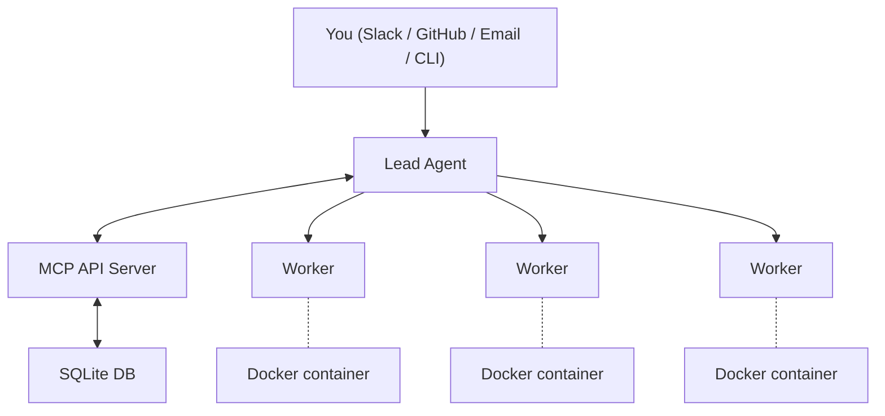

# Architecture Overview

Agent Swarm follows a hub-and-spoke architecture where a central MCP API server coordinates communication between agents.

## System Diagram



## Core Components

### MCP API Server

The MCP (Model Context Protocol) server is the central coordination point. It:

- Exposes tools via the MCP protocol (both STDIO and HTTP transports)
- Manages agent registration and task assignment
- Stores all state in a SQLite database
- Handles integrations (Slack, GitHub, AgentMail webhooks)
- Runs the task scheduler for recurring automation

The server runs on port `3013` by default and is implemented in `src/http.ts` with tool definitions in `src/server.ts`.

### Lead Agent

The lead agent is the coordinator. It:

- Receives incoming tasks from external sources (Slack, GitHub, email)
- Has an **inbox** for triaging incoming messages
- Breaks down complex tasks and delegates to workers
- Monitors worker progress and provides feedback
- Communicates results back to the user
- Can inject learnings into worker memories

### Worker Agents

Workers are the execution layer. Each worker:

- Runs in an isolated Docker container with a full development environment
- Has access to git, Node.js, Python, Bun, and common CLI tools
- Executes tasks assigned by the lead agent
- Reports progress via the `store-progress` MCP tool
- Can expose HTTP services on port 3000
- Learns from each session and builds compounding knowledge

### Docker Runtime

Each worker container includes:

- **Languages**: Python 3, Node.js 22, Bun
- **Build tools**: gcc, g++, make, cmake
- **Process manager**: PM2 (for background services)
- **CLI tools**: GitHub CLI (`gh`), sqlite3
- **Agent tools**: `wts` (git worktree manager)
- **Utilities**: git, git-lfs, vim, nano, jq, curl, wget, ssh
- **Sudo access**: Workers can install packages with `sudo apt-get install`

## Data Flow

### Task Creation

1. User sends a message (Slack DM, GitHub @mention, email, or API call)
2. MCP server receives the webhook/request
3. Lead agent's inbox receives the message
4. Lead agent triages and creates tasks for workers

### Task Execution

1. Worker polls for or receives a task assignment
2. Worker starts a Claude Code session with the task context
3. Worker executes the task, using MCP tools for coordination
4. Worker reports progress via `store-progress`
5. On completion, output is saved and the lead is notified

### Learning Loop

1. At session end, a summary model extracts key learnings
2. Learnings are embedded and stored in the memory system
3. On next task, relevant memories are retrieved and included in context
4. The lead can also inject learnings directly into workers

## Project Structure

```
agent-swarm/
├── src/
│   ├── cli.tsx          # CLI entry point (Ink/React)
│   ├── http.ts          # HTTP server entry
│   ├── server.ts        # MCP server setup & tool registration
│   ├── tools/           # MCP tool implementations
│   ├── be/              # Backend (database, business logic)
│   │   └── db.ts        # SQLite database
│   ├── commands/        # CLI command implementations
│   │   ├── runner.ts    # Task runner (polls and spawns sessions)
│   │   ├── worker.ts    # Worker agent command
│   │   └── lead.ts      # Lead agent command
│   └── hooks/           # Claude Code hooks
├── deploy/              # Deployment scripts
├── scripts/             # Utility scripts
├── ui/                  # Dashboard UI (React)
├── docker-compose.example.yml
├── Dockerfile           # API server image
├── Dockerfile.worker    # Worker image
└── package.json
```

## Technology Stack

| Component | Technology |
|-----------|-----------|
| Runtime | Bun |
| API Protocol | MCP (Model Context Protocol) |
| Database | SQLite (via `bun:sqlite`) |
| AI Runtime | Claude Code (headless) |
| Containerization | Docker |
| Process Management | PM2 |
| Memory Embeddings | OpenAI `text-embedding-3-small` |
| Dashboard | React + Vite |
| Schema Validation | Zod |
