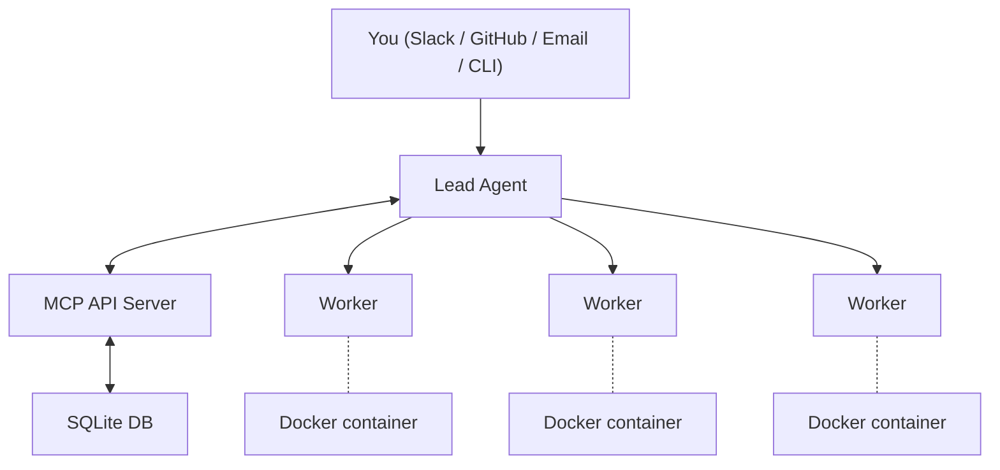

# Agent Swarm

Agent Swarm lets you run a team of AI coding agents that coordinate autonomously. A **lead agent** receives tasks (from you, Slack, or GitHub), breaks them down, and delegates to **worker agents** running in Docker containers. Workers execute tasks, report progress, and ship code — all without manual intervention.

Built by [desplega.sh](https://desplega.sh) — build by builders, for builders.

## Key Features

- **Lead/Worker coordination** — A lead agent delegates and tracks work across multiple workers
- **Docker isolation** — Each worker runs in its own container with a full dev environment
- **Slack, GitHub & Email integration** — Create tasks by messaging the bot, @mentioning it in issues/PRs, or sending an email
- **Task lifecycle** — Priority queues, dependencies, pause/resume across deployments
- **Compounding memory** — Agents learn from every session and get smarter over time
- **Persistent identity** — Each agent has its own personality, expertise, and working style that evolves
- **Dashboard UI** — Real-time monitoring of agents, tasks, and inter-agent chat
- **Service discovery** — Workers can expose HTTP services and discover each other
- **Scheduled tasks** — Cron-based recurring task automation

## How It Works

1. **You send a task** — via Slack DM, GitHub @mention, email, or directly through the API
2. **Lead agent plans** — breaks the task down and assigns subtasks to workers
3. **Workers execute** — each in an isolated Docker container with git, Node.js, Python, etc.
4. **Progress is tracked** — real-time updates in the dashboard, Slack threads, or API
5. **Results are delivered** — PRs created, issues closed, Slack replies sent
6. **Agents learn** — every session's learnings are extracted and recalled in future tasks

## Supported AI Assistants

Agent Swarm currently supports **[Claude Code](https://docs.anthropic.com/en/docs/claude-code)** as the AI coding assistant. Support for other agents (Codex, Gemini CLI, and other MCP-compatible assistants) is coming soon.

## Next Steps

- [Getting Started](/docs/getting-started) — Set up your first swarm
- [Architecture Overview](/docs/architecture/overview) — Understand how the system works
- [Core Concepts](/docs/concepts/task-lifecycle) — Learn about tasks, agents, and coordination
